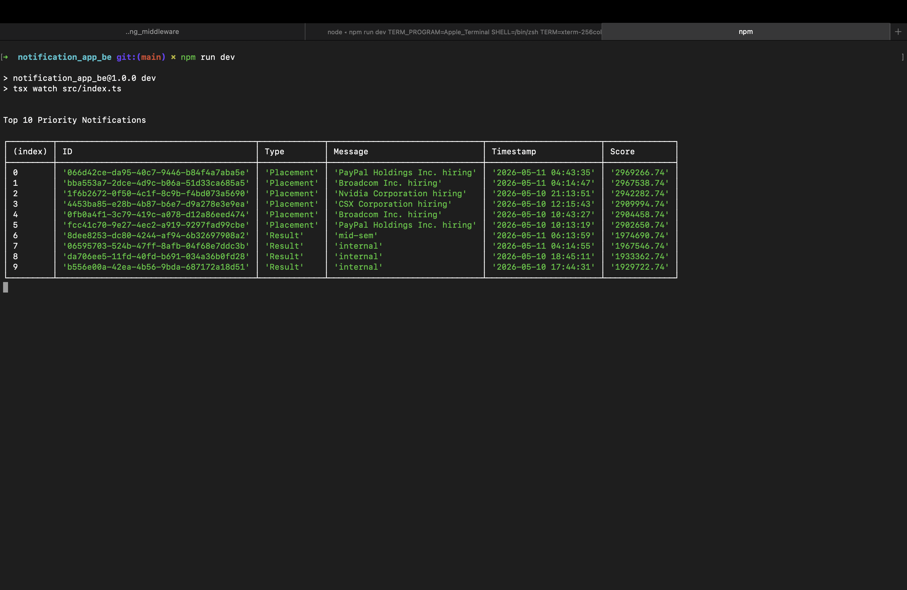

# Stage 1 - Notification System API Design

## Overview

The notification system gives REST APIs and real-time notifications to users using websockets for real-time notifications utilizing ws library.

## Features

- Create notification
- Fetch notifications
- Mark notifications as read
- Delete notifications
- Filter notifications
- Real-Time notifications

---

# Base URL

```http
/api/v1
```

---

# Notification Object

```json
{
  "id": "uuid",
  "userId": "uuid",
  "type": "Placement",
  "title": "Placement Drive",
  "message": "Google hiring drive started",
  "isRead": false,
  "createdAt": "2026-05-11T10:30:00Z"
}
```

---

# Notification Types

```txt
Event
Result
Placement
```

---

# APIs

## Create Notification

```http
POST /notifications
```

Request:

```json
{
  "userId": "uuid",
  "type": "Placement",
  "title": "Placement Opportunity",
  "message": "Amazon hiring drive started"
}
```

Response:

```json
{
  "success": true,
  "message": "Notification created successfully"
}
```

---
## Fetch Notifications

```http
GET /notifications?limit=10&type=Placement
```

Query Params:

| Param | Description |
|---|---|
| limit | Number of notifications to fetch |
| type | Filter by notification type |

Response:

```json
{
  "success": true,
  "data": {
    "notifications": []
  }
}
```

---
## Get Notification By ID

```http
GET /notifications/:id
```

---

## Mark Notification As Read

```http
PATCH /notifications/:id/read
```

Response:

```json
{
  "success": true,
  "message": "Notification marked as read"
}
```

---

## Delete Notification

```http
DELETE /notifications/:id
```

Response:

```json
{
  "success": true,
  "message": "Notification deleted successfully"
}
```

---

# Real-Time Notifications

## WebSocket Endpoint

```txt
/ws/notifications
```

## Event

```txt
new_notification
```

Payload:

```json
{
  "id": "uuid",
  "type": "Placement",
  "message": "Microsoft hiring drive started"
}
```

---

# Error Response

```json
{
  "success": false,
  "message": "Notification not found"
}
```

---

# Logging Middleware

All APIs use the reusable logging middleware.

Example:

```ts
await Log(
  "backend",
  "info",
  "route",
  "GET /notifications endpoint called"
);
```

---

# Authentication

Users are assumed to be pre-authorized as told in the doc provided.


# Stage 2 - Database Design

## Database Choice

I am using PostgreSQL as the primary database because it provides:

- Strong relational consistency
- Efficient indexing
- Better query performance for filtering and sorting
- ACID transaction support
- Scalability for large notification datasets

---

# Notifications Table Schema

```sql
CREATE TYPE notification_type AS ENUM (
  'Event',
  'Result',
  'Placement'
);

CREATE TABLE notifications (
  id UUID PRIMARY KEY,
  user_id UUID NOT NULL,
  type notification_type NOT NULL,
  title VARCHAR(255) NOT NULL,
  message TEXT NOT NULL,
  is_read BOOLEAN DEFAULT FALSE,
  created_at TIMESTAMP DEFAULT CURRENT_TIMESTAMP
);
```

---

# Indexes

```sql
CREATE INDEX idx_user_notifications
ON notifications(user_id);

CREATE INDEX idx_notification_type
ON notifications(type);

CREATE INDEX idx_user_read
ON notifications(user_id, is_read);

CREATE INDEX idx_created_at
ON notifications(created_at DESC);
```

---

# API Queries

## Create Notification

```sql
INSERT INTO notifications (
  id,
  user_id,
  type,
  title,
  message
)
VALUES (
  gen_random_uuid(),
  $1,
  $2,
  $3,
  $4
);
```

---

## Fetch Notifications

```sql
SELECT id, type, title, message, is_read, created_at
FROM notifications
WHERE user_id = $1
AND ($2::text IS NULL OR type = $2)
ORDER BY created_at DESC
LIMIT $3;
```

---

## Mark Notification As Read

```sql
UPDATE notifications
SET is_read = TRUE
WHERE id = $1;
```

---

## Delete Notification

```sql
DELETE FROM notifications
WHERE id = $1;
```

---

# Scaling Challenges

As notification volume increases, the following issues may occur:

- Slow query performance
- High database load
- Increased response time
- Expensive sorting operations
- Large unread notification scans

---

# Solutions

## Indexing

Indexes are added on:
- user_id
- type
- is_read
- created_at

to improve filtering and sorting performance.

---

## Query Optimization

Only required fields are selected instead of using:

```sql
SELECT *
```

This reduces query cost and response size.

---

## Caching

Frequently accessed notifications and unread counts can be cached using Redis to reduce database load.

---

## Pagination and Limits

The API uses limits to avoid fetching large datasets in a single request.

---

## Real-Time Delivery

Websockets are used to deliver real-time notifications to the client.


# Stage 3 - Query Optimization

## Given Query

```sql
SELECT * FROM notifications
WHERE studentID = 1042 AND isRead = false
ORDER BY createdAt ASC;
```

---

# Problems In The Query

- `SELECT *` fetches unnecessary columns
- No query limit is applied
- Sorting large datasets is expensive
- Ascending sorting on large tables increases computation cost
- Query performance becomes slow without proper indexing

---

# Optimized Query

```sql
SELECT id, type, title, message, created_at
FROM notifications
WHERE user_id = $1
AND is_read = FALSE
ORDER BY created_at DESC
LIMIT 50;
```

---

# Why This Query looks better to me

- Only required columns are selected
- `LIMIT` reduces fetched records
- Descending order helps fetch latest notifications first
- Optimized for indexed access
- Lower memory and computation cost

---

# Recommended Index

```sql
CREATE INDEX idx_user_read_created
ON notifications(user_id, is_read, created_at DESC);
```

---

# Why This Index Is Effective

The index improves:
- Filtering by `user_id`
- Filtering unread notifications using `is_read`
- Sorting using `created_at`

This reduces full table scans and improves query execution speed.

---

# Computation Cost

Without indexes:
- Full table scan
- Time Complexity: `O(n log n)`

With composite index:
- Indexed lookup
- Time Complexity: approximately `O(log n)`

---

# Should Indexes Be Added On Every Column?

No.

Adding indexes on every column is not effective because:
- Insert and update operations become slower
- Additional storage is required
- Unused indexes waste resources
- Database maintenance cost increases

Indexes should only be created on frequently filtered, sorted, or joined columns.

---

# Query To Find Placement Notifications In Last 7 Days

```sql
SELECT DISTINCT user_id
FROM notifications
WHERE type = 'Placement'
AND created_at >= NOW() - INTERVAL '7 days';
```

---

# Optimization Techniques Used

- Composite indexing
- Selecting only required columns
- Limiting result size
- Efficient sorting
- Indexed filtering


# Stage 4 - High Traffic Scaling

## Challenges

If 1000+ students refresh notifications every minute, the system may face the following challenges:

- High database load
- Increased API response time
- Frequent repeated queries
- Increased server traffic
- Slow notification delivery

---

# Solutions

## Redis Caching

Frequently accessed notifications and unread counts can be cached in Redis.

Flow:

```txt
Client → Redis Cache → PostgreSQL
```

If data exists in cache, the database is not queried.

---

## WebSockets

WebSockets are used for real-time notification delivery.

This reduces repeated API polling from clients and decreases unnecessary requests to the backend.

---

## Request Limits

The API uses limits while fetching notifications to avoid large database reads.

Example:

```http
GET /notifications?limit=10
```

---

## Database Indexing

Indexes are added on:
- user_id
- is_read
- created_at
- type

to improve filtering and sorting performance.

---

## Load Balancing

Multiple backend servers can be deployed behind a load balancer to distribute traffic evenly.

---

# API Response Optimization

Only required fields are returned instead of using:

```sql
SELECT *
```

This reduces response size and improves performance.

---

# Expected Result

Using caching, indexing, and WebSockets significantly reduces:
- database load
- API latency
- repeated polling
- unnecessary network traffic

while improving scalability and real-time performance.


# Stage 5 - Notification Delivery Architecture

## Problems In The Given Approach

The provided notification delivery approach has the following issues:

- Notifications are processed sequentially
- Failure in one service can stop the entire flow
- No retry mechanism exists
- No scalability for large traffic
- Tight coupling between services
- High response time for users

---

# Improved Architecture

A queue-based asynchronous architecture is used for reliable and scalable notification delivery.

Flow:

```txt
Client Request
      ↓
Backend API
      ↓
Store Notification In Database
      ↓
Push Job To Queue
      ↓
Workers Process Notifications
      ├── WebSocket Worker
      ├── Email Worker
      └── Push Notification Worker
```

---

# Queue System

Redis with BullMQ is used for background job processing.

Benefits:
- Asynchronous processing
- Retry support
- Better scalability
- Fault tolerance
- Reduced API response time

---

# Retry Mechanism

Failed jobs are automatically retried using exponential backoff.

Example:
- Retry after 5 seconds
- Retry after 15 seconds
- Retry after 30 seconds

This improves reliability during temporary failures.

---

# Idempotency

Each notification job contains a unique job ID to avoid duplicate notification delivery during retries.

---

# Failure Handling

If a worker fails:
- The job remains in the queue
- Retry mechanism attempts delivery again
- Failed jobs can be moved to a dead letter queue for debugging

---

# Benefits Of This Architecture

- Faster API responses
- Reliable notification delivery
- Better scalability
- Fault isolation between services
- Improved system stability during high traffic

---

# Real-Time Delivery

WebSocket workers instantly push notifications to connected users after processing the queue.

This reduces client-side polling and improves user experience.
If we don't use WebSockets, the client would have to poll the API every few seconds to check for new notifications which is also called long polling.


# Stage 6 - Priority Notifications

## Overview

A Priority Inbox system is implemented to display the top 10 most important unread notifications.

Priority is determined using:
- Notification type
- Recency of notification

Priority order:

```txt
Placement > Result > Event
```

---



# Notification Source

Notifications are fetched dynamically from the provided Notification API.

```http
GET http://4.224.186.213/evaluation-service/notifications
```

Authorization headers are included while fetching notifications.

---

# Priority Calculation

Each notification is assigned a score using:
- Higher weight for important notification types
- Higher priority for recent notifications

Formula:

```txt
score = (typeWeight * 1000000) - notificationAgeInSeconds
```

Weights:

| Type | Weight |
|---|---|
| Placement | 3 |
| Result | 2 |
| Event | 1 |

---

# Approach

1. Fetch notifications from API
2. Calculate priority score for each notification
3. Sort notifications based on score
4. Return top 10 notifications

---

# Complexity

```txt
Sorting Complexity: O(n log n)
Overall Complexity: O(n log n)
```

---

# Scalability

The implementation supports continuous incoming notifications.

As new notifications arrive:
- Scores are recalculated
- Notifications are re-sorted
- Latest top 10 notifications are returned

---

# Optimization

Only top 10 notifications are returned to reduce unnecessary data processing and improve response time.

---

# Technologies Used

- Node.js
- TypeScript
- Fetch API
- WebSockets